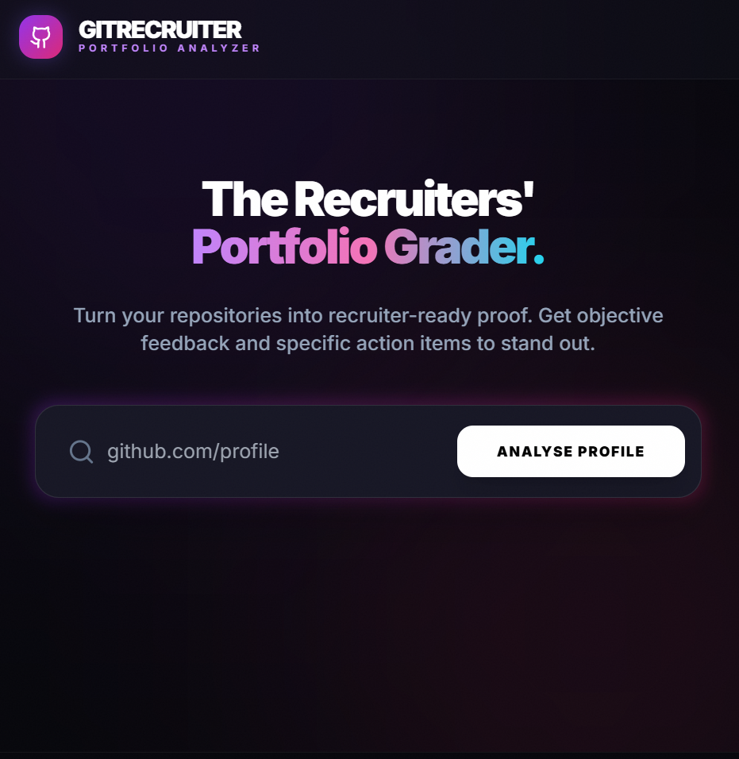
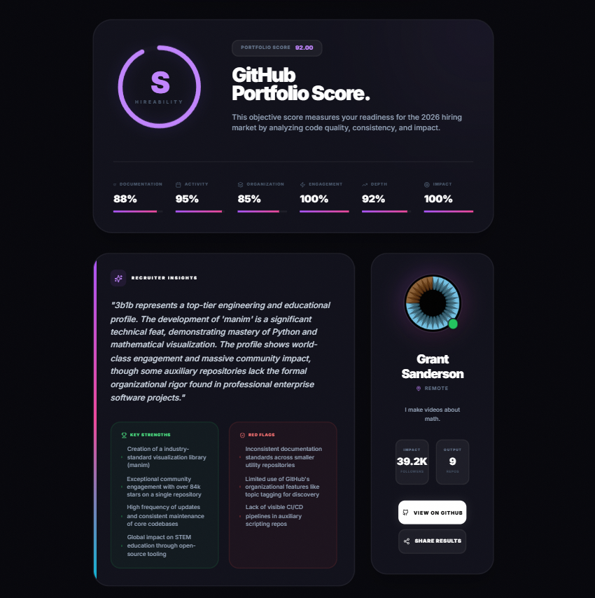
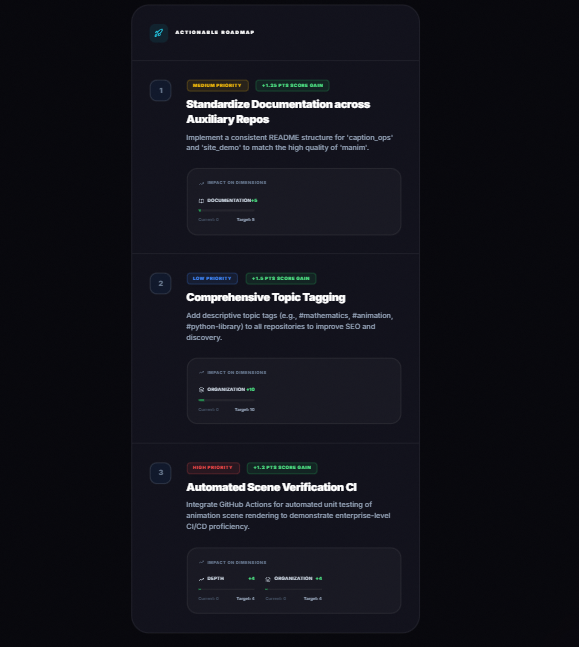

# GitRecruiter AI - GitHub Portfolio Analyzer

> Turn repositories into recruiter-ready proof. Built for UnsaidTalks Hackathon 2026.

[](https://git-hub-portfolio-analyser-enhancer-xi.vercel.app/)
[](https://github.com/Aral-549/GitHub-Portfolio-Analyser-Enhancer)

##  The Problem

Students and early-career developers struggle to understand how recruiters evaluate GitHub profiles. Most profiles fail to communicate real skill, impact, or consistency - even when technical ability exists.

**Key Challenges:**
- No objective feedback on portfolio quality
- Unclear what recruiters actually look for
- No prioritized action plan for improvement

##  The Solution

GitRecruiter AI provides instant, AI-powered GitHub portfolio analysis in under 2 minutes:

 **Objective Scoring** - Grade (S/A/B/C/D/F) + Overall score (0-100)  
 **6 Key Dimensions** - Documentation, Activity, Organization, Engagement, Depth, Impact  
 **Actionable Recommendations** - Specific improvements with exact score gain predictions  
 **Recruiter Perspective** - Analysis based on what recruiters actually evaluate

##  Quick Start

**Try it now:** [https://git-hub-portfolio-analyser-enhancer-xi.vercel.app/](https://git-hub-portfolio-analyser-enhancer-xi.vercel.app/)

Just paste any GitHub username or URL - no signup required!

## 📹 Demo Video

[**Watch 5-Minute Demo →**](https://youtu.be/_6kBbYMqroA)

*Screen recording showing live working prototype - Coming Soon*

##  Key Features

### 1. Instant Analysis
Paste a GitHub username and get comprehensive analysis in under 2 minutes.

### 2. Multi-Dimensional Scoring
- **Documentation** (README quality, code comments)
- **Activity** (Commit consistency, maintenance)
- **Organization** (Project structure, naming)
- **Engagement** (Stars, forks, community)
- **Depth** (Technical complexity, skills)
- **Impact** (Real-world relevance, business value)

### 3. Impact-Quantified Recommendations
Every suggestion shows:
- Exact score gain (e.g., +12 points)
- Which dimensions improve
- Priority level (High/Medium/Low)

### 4. Visual Dashboard
- Grade badge with color coding
- Radar chart for 6 dimensions
- Progress bars for each metric
- User profile summary

## 🛠️ Tech Stack

- **Frontend:** React 19 + TypeScript
- **Styling:** TailwindCSS
- **AI:** Google Gemini 1.5 Flash
- **APIs:** GitHub REST API
- **Deployment:** Vercel

##  Installation

```bash
# Clone repo
git clone https://github.com/Aral-549/GitHub-Portfolio-Analyser-Enhancer.git
cd GitHub-Portfolio-Analyser-Enhancer

# Install dependencies
npm install

# Add your Gemini API key
cp .env.example .env
# Edit .env and add: VITE_GEMINI_API_KEY=your_key_here

# Run locally
npm run dev
```

**Get Gemini API Key:** https://makersuite.google.com/app/apikey (Free tier available)

##  How It Works

1. **Input** - User pastes GitHub username or profile URL
2. **Fetch** - App retrieves public repos and profile data via GitHub API
3. **Analyze** - Gemini AI evaluates portfolio across 6 dimensions
4. **Display** - Results shown with grade, scores, strengths, weaknesses, and prioritized recommendations

##  What Makes This Innovative?

 **Recruiter-First Scoring** - Based on actual hiring criteria, not just vanity metrics  
 **AI-Powered Insights** - Deep analysis of README quality, code organization, project storytelling  
 **Quantified Impact** - Every recommendation shows exact potential score gain  
 **Zero Friction** - No signup, instant results, mobile responsive  

##  Hackathon Criteria Coverage

| Criteria | How We Excel |
|----------|-------------|
| **Impact (20%)** |  Under 2-minute analysis, zero signup friction |
| **Innovation (20%)** |  Recruiter-first scoring + impact predictions |
| **Technical (20%)** |  Clean TypeScript, AI integration, production-ready |
| **UX (25%)** |  Beautiful UI, hosted live, mobile responsive |
| **Presentation (15%)** |  Professional demo video, clear documentation |

##  Screenshots

### Landing Page

*Clean, professional interface with instant search*

### Analysis Results  

*Comprehensive portfolio score with 6-dimension breakdown and recruiter insights*

### Actionable Recommendations

*Prioritized improvement suggestions with impact predictions*

##  Future Enhancements

- Repository-specific deep dives
- Before/after tracking
- PDF report export
- Comparison with peers
- GitHub Action integration

##  License

MIT License - Use freely for learning and development

##  Author

**Shaik Arshad Ali**  
GitHub: [@Aral-549](https://github.com/Aral-549)  
LinkedIn: [Shaik Arshad Ali](https://www.linkedin.com/in/shaik-arshad-ali-45483930b)

##  Acknowledgments

Built for **UnsaidTalks Hackathon 2026**  
Submission Deadline: 13th Feb 2026, 11:59 PM

---

** If this tool helped you, give it a star!**

** [Try Live Demo](https://git-hub-portfolio-analyser-enhancer-xi.vercel.app/)**
